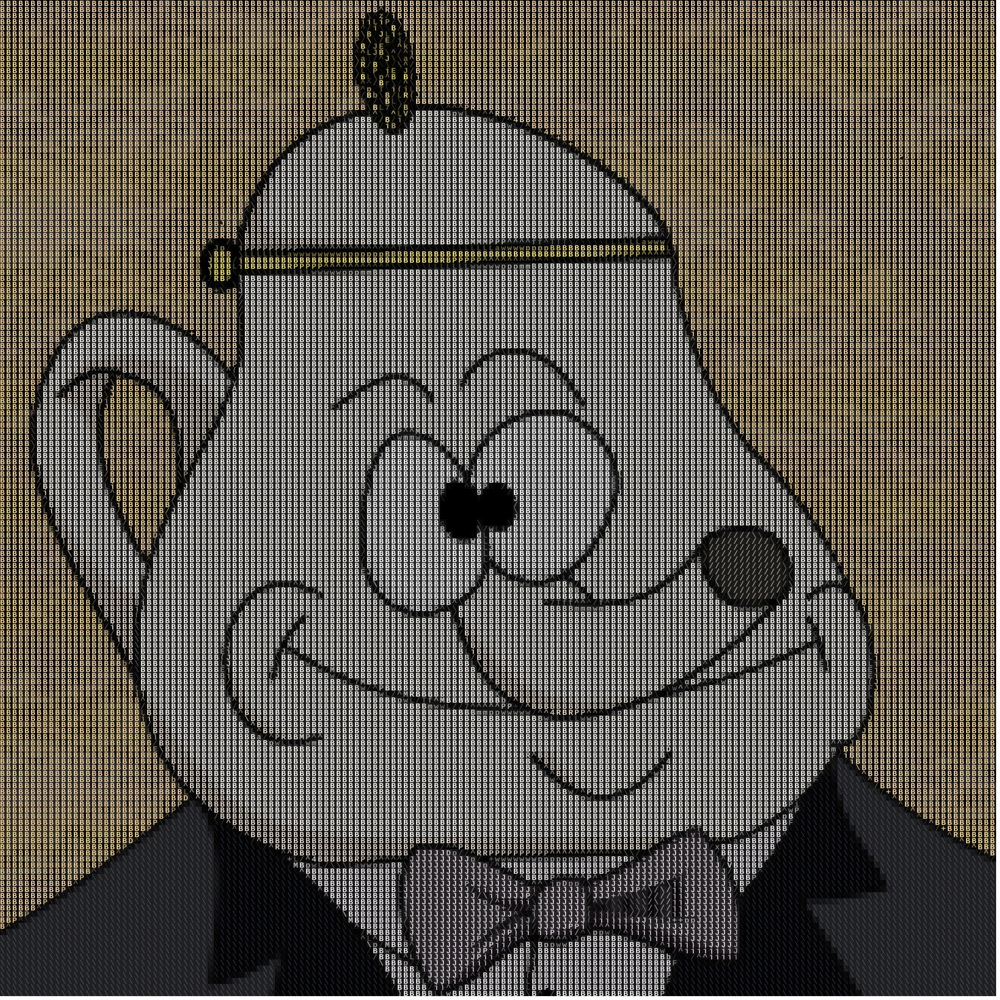

# rustcii
Simple image to ascii image.

## How to use it?
`rustcii input.jpg outpug.jpg`.

## Supported formats
Every supported format in [piston's image library](https://github.com/PistonDevelopers/image#21-supported-image-formats) should be available.